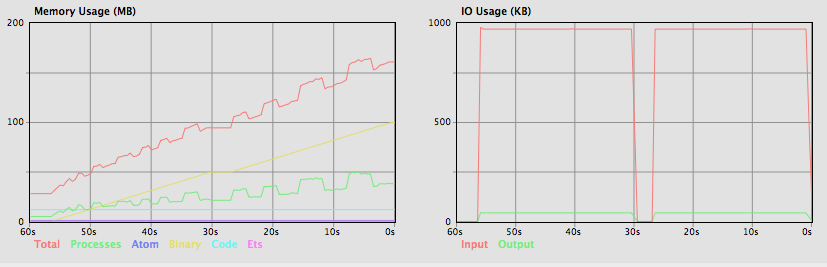
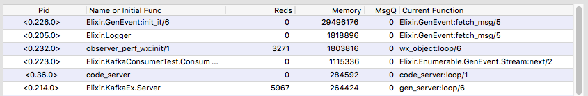

# KafkaConsumerTest

Testing an apparent memory leak in streaming kafka messages with KafkaEx. Issue raised as [KafkaEx#141](https://github.com/kafkaex/kafka_ex/issues/141).

## Usage

Have kafka running locally.

Get the repo and deps:

```
git clone https://github.com/dplummer/kakfa_consumer_test.git
cd kafka_consumer_test
mix deps.get
```

Compile and run the consumer and start the observer (in prod env if that matters):

```
MIX_ENV=prod mix compile
MIX_ENV=prod iex -S mix
iex> :observer.start
```

Run the producer from a different terminal:

```
mix producer
```

## Observed behavior on my MacBook Pro

Ran the producer twice and captured the memory and process graphs from the observer. Memory did not decrease after 5 minutes of no activity, except in Elixir.KafkaEx.Server, which did decrease to ~143k (from 264k).



